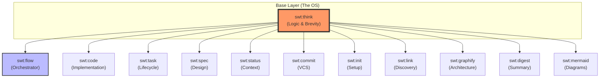
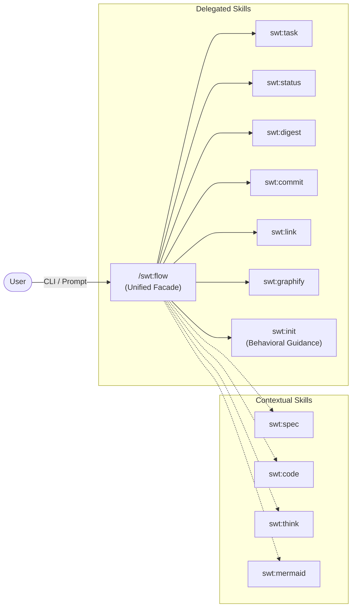

# SWT Structural Manifest (Architecture)

This document defines the structural integrity and design patterns of the Simple Workflow Toolkit. While `AGENTS.md` defines how agents should **behave**, `ARCHITECTURE.md` defines how the toolkit is **built**.

## 1. Skill Inheritance Hierarchy

All SWT skills follow a strict inheritance model. `swt:think` provides the foundational behavioral principles (Brevity, Focus, Locked Gates) that all other skills must adhere to.



## 2. The Orchestrator Pattern (Unified Facade)

To reduce cognitive overhead for both users and agents, `/swt:flow` acts as a **Unified Facade**. It is the single entry point for all high-level toolkit operations. Instead of remembering 12 different skill invocations, you interact with the Orchestrator.



### Routing Logic
- **Direct Delegation**: Commands like `install`, `link`, `status`, and `commit` are passed directly to the backing shell scripts in their respective skill folders.
- **Smart Search**: The `view-task` command uses a resolution helper to find task files in both active (`.tasks/`) and archived (`.tasks/archive/`) directories.
- **Behavioral Guidance**: Skills like `init` that lack a backing shell script are handled via a guidance message that directs the agent's behavior.

## 3. Separation of Concerns

The toolkit's documentation is divided into three distinct layers to prevent "God Document" syndrome and reduce drift.

| Document | Purpose | Audience |
|---|---|---|
| **AGENTS.md** | **Atomic Methodology** — Rules of engagement, recursive state machine, and consent gates. | AI Agents |
| **SKILLS.md** | **Operational Catalog** — CLI reference, command table, and usage examples. | Users & Agents |
| **ARCHITECTURE.md** | **Structural Manifest** — Inheritance model, design patterns, and system rationale. | Contributors & Agents |

## 4. Recursive Workflow Rationale

Unlike standard linear workflows, SWT assumes that **understanding is iterative**. The recursive state machine is physically baked into the **`swt:flow`** skill instructions, explicitly modeling the "Light Bulb Reset" where implementation findings force a loop back to planning. 

This architecture ensures that agents never "ghost" changes into the codebase without re-aligning the documentation (Specs/Plans) first. By consolidating these rules into the orchestrator, we eliminate documentation drift and ensure the **Senior Advisor** persona is consistently enforced.

Every skill directory contains a `SKILL.md` file with a YAML frontmatter block. This block identifies the skill's name and its parent in the inheritance hierarchy.

```yaml
---
name: "swt:task"
inherits: "swt:think"
...
---
```

This allows for future automated tooling to verify that all skills in the ecosystem are correctly following the base reasoning protocols.

## 5. State-as-Source Architecture (Sidecar Cluster)

To ensure document structural integrity and total idempotency, SWT employs a **Global Twin** architecture. This separates the **Machine State** (authoritative YAML) from the **Markdown Projection** (human-readable view).

### 1. The Twin Engine (`twin.py`)
- **Engine**: A centralized Python parser and renderer that handles all programmatic document updates.
- **Sidecar Cluster**: Machine state is persisted in timestamped YAML files within the `.tasks/` directory, mirroring the task lifecycle.
- **YAML Formatting**: Uses YAML block scalars (`|`) for prose sections, ensuring that multiline content and markdown syntax are preserved without escaping.

### 2. Bidirectional Sync
- **Harvesting**: Captures manual human edits from the Markdown projection into the YAML state.
- **Synthesis**: Re-renders the Markdown from the state using standardized templates.

### 3. Implementation Integrity
This architecture eliminates the risk of "destructive scaffolding" during re-syncs. By centralizing machine state in the Sidecar Cluster, the project root remains clean of ephemeral planning artifacts while maintaining a persistent audit trail of the entire task lifecycle.

### 3. Workflow Integration
Core commands (`new`, `graduate`, `phase`, `sync-docs`) are physically bound to this loop, preventing agents from bypassing state management through direct file string manipulation.
