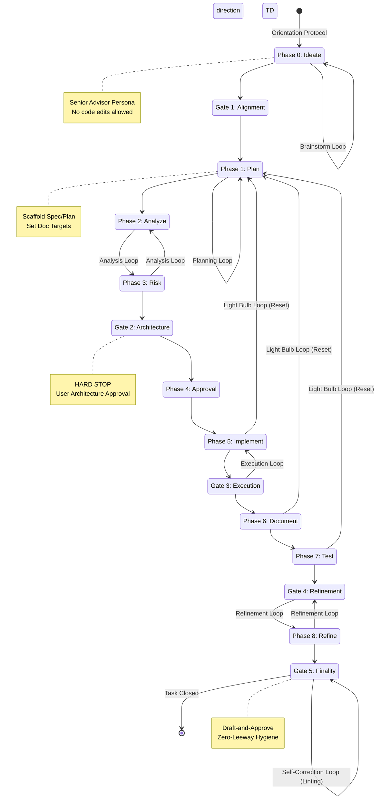

# SWT Iteration Loops

The Simple Workflow Toolkit (SWT) is built on several nested iteration cycles and "Gate" protocols that ensure alignment and prevent architectural drift. This document visualizes these loops and their relationship to the 8-phase development lifecycle.

## 🌀 Loop Visualization

---

## 📖 Loop Definitions

### 1. Orientation Protocol ([*] → P0)
Every new session begins with this recovery cycle. The agent runs `/swt:flow status` to aggregate the latest digests and tasks, reads `task.ctx` to find the active context, and automatically opens relevant docs for the user.

### 2. Brainstorm Loop (Phase 0)
The ideation cycle where the agent acts as a **Senior Advisor**. It requires a Scenario A/B/C trade-off analysis (Discipline vs. Automation vs. Enforcement) before the user provides the "Go" to graduate to implementation.

### 3. Planning & Analysis Loops (Phases 1–3)
*   **Planning Loop**: Artifact generation (`implementation_plan.md`, `protocol.md`) and identifying documentation targets.
*   **Analysis Loop**: Assessing the impact on components, state management, performance, and API contracts.
*   **Gate 2 (The Architecture Loop)**: A **HARD STOP** where the technical approach must be approved by the user.

### 4. Execution Loop (Phases 5–7)
The implementation cycle where surgical edits are made. It is governed by the `protocol.md` (Tactical Roadmap) and `task.md` (Live Checklist). Automated tests are run via `swt.sh test` to provide physical evidence of correctness.

> 📊 **Tactical Visibility**: To ensure **HITL-friendly automation**, the `protocol.md` roadmap is automatically surfaced in the `/swt:flow status` report. Agents are mandated to run a status check after every tactical chunk update to verify alignment with the user.

### 5. Light Bulb Iteration Loop (Reset Mechanism)
A critical "Fail-Safe" that triggers if requirements or understanding change mid-implementation.
1.  **Update Task**: Log new ideas.
2.  **Sync-Downstream**: Automatically update Spec and Plan.
3.  **Mandatory Reset**: Physically resets the task to Phase 1, forcing a re-approval at Gate 2.

### 6. Refinement Loop (Phase 8)
Occurs after the MVP is verified. The task enters a "Polishing" cycle at **Gate 4** where the user can append fine-tuning items or UI tweaks. The loop continues until the user explicitly initiates the closure sequence.

### 7. The Commit Loop (Gate 5)
The finality sequence governing the move from code to history.
*   **Draft-and-Approve**: The agent drafts `commit.draft` and `commit.task`.
*   **Self-Correction Loop**: The draft is passed through a hard shell gate (`lint.sh`). If it fails (e.g., contains file paths or jargon), the agent must autonomously self-correct (up to 3 attempts).
*   **Zero-Leeway Hygiene**: Upon approval, the task is closed, and all ephemeral artifacts are physically purged from the workspace.

### 8. The Global Twin Protocol (Internal State Loop)
A foundational technical cycle that runs inside every programmatic document update. It ensures that the agent never "forgets" manual human edits or implementation progress.
1.  **Harvest**: Extract current document content into JSON.
2.  **Modify State**: Update metadata and checklists in memory.
3.  **Synthesize**: Re-project the document from state using standard templates.

