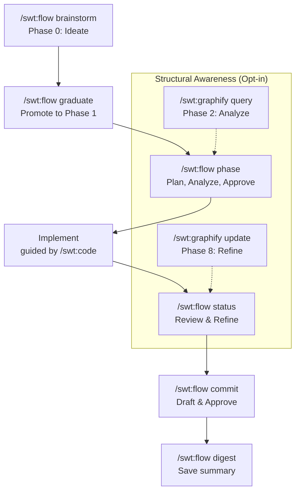

# SWT Skills Catalog

The Simple Workflow Toolkit is a suite of AI agent skills that enforce disciplined, consent-gated software development. Install it into any project and every session follows a structured workflow — from initial idea to verified commit.

> **Agent Behavior Note**: Before creating any file or task, your agent will always propose a name and wait for your confirmation. You stay in control of every decision.

## Skill Categories

Based on their purposes and triggers:

### Planning & Design
- **swt:spec**: Turns ideas into structured PRDs/specs.
- **swt:think**: Base behavioral guidelines for reasoning in non-coding tasks.

### Workflow & Task Management
- **swt:flow**: Enforces 8-phase development lifecycle.
- **swt:task** — Owns the lifecycle of task files. Enforces naming rules, provides templates, handles Phase 0 graduation, and automates root artifact cleanup (`implementation_plan.md`, `protocol.md`, `task.md`) upon closure.
- **swt:status**: Aggregates project state for session restoration.

### Implementation & Coding
- **swt:code**: Guidelines for surgical, minimal code changes.
- **swt:graphify**: Structural awareness and dependency mapping (Opt-in).

### Version Control & Commits
- **swt:commit**: Diff-first, draft-and-approve commit workflow.

### Initialization & Setup
- **swt:init**: Bootstraps projects with AGENTS.md and scaffolding.
- **swt:link**: Manages symlinks for skill discovery.

### Documentation & Visualization
- **swt:mermaid**: Ensures correct syntax in Mermaid diagrams.

### Session Continuity
- **swt:digest**: Automates structured session summaries.

---

## How Skills Work Together

The skills are designed to work in sequence. Here is the typical lifecycle of a feature from idea to commit:

Use `/swt:task mount <file>` to set the active task context before entering `/swt:flow`.



---

## 🧠 Base Behavioral Skills

### `/swt:think` — Reasoning Guidelines

Base behavioral guidelines for all AI agent reasoning. **All other SWT skills inherit from this skill.**

Provides the core principles (Think, Brevity, Focus, Clear Success Criteria) that `swt:code`, `swt:digest`, `swt:task`, `swt:spec`, `swt:init`, and `swt:commit` adapt for their specific contexts.

**When to use**: This skill loads automatically as the base layer when any generation skill is triggered. Agents apply these principles to all non-coding reasoning tasks.

---

## 🛠️ Core Management Skills

### `/swt:flow` — Workflow Enforcer

Guides you through the full 8-phase development lifecycle with mandatory consent gates. The agent acts as a **Senior Advisor** — it presents plans, analyzes risks, and waits for your approval before writing any code.

**When to use**: Before starting any non-trivial feature or change.

**Key consent gates**:
- **Gate 2**: Agent presents the full plan and waits for your explicit "GO" before implementation.
- **Gate 4**: Agent pauses after the MVP works and waits for your review before finalizing.

**Key commands**:
| Command | Purpose | Delegation |
|---|---|---|
| `/swt:flow brainstorm` | Create Phase 0 ideation task | `swt:task` |
| `/swt:flow graduate` | Promote brainstorm to Phase 1 | `swt:task` |
| `/swt:flow phase <N>` | Transition task to Phase N | `swt:task` |
| `/swt:flow status` | Show project status and tasks | `swt:status` |
| `/swt:flow commit` | Start commit ritual | `swt:commit` |
| `/swt:flow digest` | Create session summary | `swt:digest` |
| `/swt:flow list` | Show all active tasks | `swt:task` |
| `/swt:flow open` | Open active task and spec | Internal |

```
/swt:flow
```

---

### `/swt:task` — Task Manager

Owns the full task lifecycle: creation, brainstorming, graduation, status tracking, and cleanup. All work is tracked in a `.tasks/` directory at the project root.

**Key commands**:

| Command | Purpose |
|---|---|
| `/swt:task new` | Create a standard implementation task (Phase 1) |
| `/swt:task brainstorm` | Create a Phase 0 ideation task for exploratory thinking |
| `/swt:task graduate` | Promote a brainstorm task to an implementation task |
| `/swt:task phase <N> <file>` | Transition task to Phase N (exclusive gateway — never edit Phase header manually) |
| `/swt:task mount <file>` | Set active task context (`task.ctx`) and open task/spec in browser |
| `/swt:task ctx clear` | Clear active task context (removes `task.ctx`) |
| `/swt:task ctx show` | Show current active task context |
| `/swt:task list --open` | Show all active tasks |
| `/swt:task update <file> --append "text"` | Append a checklist item to a task |
| `/swt:task close <file> <hash>` | Finalize a task as done (status: done, checklist: complete) |
| `/swt:task abandon <file>` | Abandon a task (status: abandoned, no commit hash) |
| `/swt:task tidy` | Archive done/abandoned tasks into `.tasks/archive/` |
| `/swt:task test <file> [--fail]` | Run tests via `swt.json` harness and log ritual breadcrumb |

---

### `/swt:init` — Workspace Bootstrap

Scaffolds an `AGENTS.md` file for any new project consuming SWT. Establishes shared conventions and auto-detects the technology stack.

**When to use**: Once, at the very start of a new project.

```
/swt:init
```

Automatically generates or updates **`GEMINI.md`** and **`CLAUDE.md`** discovery pointers at the project root. These shims redirect agents to the `AGENTS.md` source of truth for all behavioral rules and workflow protocols.

---

### `/swt:link` — Skill Linker

Creates or refreshes symlinks to install SWT skills into agent discovery paths (`.claude/`, etc.). Supports dogfooding live changes across multiple agents.

**When to use**: After adding a new skill or setting up a new development environment.

```
/swt:link              # Link into the current project
/swt:link --global     # Link globally (~/.claude)
/swt:link /path        # Link into a specific directory
```

---

## 📝 Ideation & Documentation Skills

### `/swt:spec` — Specification Generator

Transforms rough ideas, brainstorms, or notes into a structured `SPEC.md` (Product Requirements Document). Bridges free-form thinking to a formal implementation plan before any code is written.

**When to use**: When you have a big idea that needs structure before creating a task.

```
/swt:spec
```

---

### `/swt:digest` — Session Continuity Manager

Creates structured session summaries so the next agent session picks up exactly where you left off. Eliminates context drift between sessions.

**When to use**: At the end of a session, or after a major milestone.

| Command | Purpose |
|---|---|
| `/swt:digest` | Standard session summary (last 5 sessions) |
| `/swt:digest --milestone` | Full project roll-up since the last milestone |

**Auto-triggers**: Say *"goodbye"*, *"done for now"*, or *"talk to you later"* and the agent will suggest running a digest automatically.

---

## 🔍 Structural Awareness Skills

### `/swt:graphify` — Project Graph Orchestrator

The "Eyes" of the toolkit. A thin wrapper for the **graphify** engine that provides structural awareness during the development workflow. It helps the agent (and you) understand the architectural "Big Picture" and surfaces risk by identifying central "God Nodes" and hidden bridges between communities.

| Command | Purpose |
|---|---|
| `/swt:graphify verify` | Check for engine presence in system PATH |
| `/swt:graphify on / off` | Explicitly enable/disable structural rituals |
| `/swt:graphify status` | Check current state and artifact presence |
| `/swt:graphify init` | Perform a full project build (deep scan) |
| `/swt:graphify query "<text>"` | Semantic search for Phase 2: Analyze |
| `/swt:graphify update` | Incremental update for Phase 8: Review |
| `/swt:graphify explain "<node>"` | Structural breakdown of a component |


**When to use**: Enable it on complex projects where understanding hidden dependencies and architectural drift is critical.

---

### `/swt:mermaid` — Diagram Syntax Guard

Prevents Mermaid diagram parse errors by enforcing correct syntax rules before writing any diagram.

**When to use**: Applied automatically whenever your agent writes a Mermaid diagram. No manual invocation needed.

---

## 💻 Execution & Quality Skills

### `/swt:code` — Coding Guidelines

Enforces surgical, minimal, goal-driven code changes. Prevents scope creep, unnecessary refactors, and speculative features.

**Inherits from `/swt:think`** — the base behavioral guidelines for all AI agent reasoning. This skill adapts those principles specifically for coding tasks.

**This is a behavioral skill** — your agent applies these guidelines automatically during every implementation phase.

**Core principles**:
- Touch only what the task requires.
- No cleanup of adjacent code unless explicitly authorized.
- No speculative features or premature abstractions.
- Every change must have a clear path to verification.

---

### `/swt:commit` — Commit Workflow

Enforces a "Diff-First, Draft-and-Approve" commit protocol. Your agent **never commits autonomously** — every commit is reviewed and approved by you before it is applied.

**How it works**:
1. Stage your changes.
2. Agent exports a `commit.diff` and drafts a human-readable `commit.draft`.
3. You review and fine-tune the message.
4. Agent applies the commit only after your explicit approval.
5. Temp files are cleaned up automatically.

```
/swt:commit
```

---

*For the internal development protocol — Locked Gates, dogfooding rituals, and agent enforcement logic — see [AGENTS.md](./AGENTS.md).*
