# AGENTS.md — {{project_name}}

{{purpose}}

## 1. Core Principles

1.  **Plan First**: Never start implementation without a detailed, peer-reviewed plan.
2.  **Surgical Changes**: Touch only what you must. Avoid "cleaning up" adjacent code unless it's part of the task. **Mandatory Cleanup**: All temporary testing artifacts (temp tasks, scratch scripts, etc.) must be deleted before finalizing the task.
3.  **Simplicity Over Specification**: No speculative features or premature abstractions.
4.  **Verifiable Outcomes**: Every change must have a clear path to verification (tests or checklists).
5.  **Gitignored Awareness**: Runtime directories (`.digests/`, `.tasks/`) are gitignored. Use `bash ls` + `read` for these — glob/search tools will return empty results.
6.  **Ritual Discipline**: "Mandatory" means mandatory. Never skip a re-read step, self-correction pass, or consent gate, even if you feel "familiar" with the context.
7.  **Exclusive Gateway**: You are FORBIDDEN from manually editing the `Phase` header in task files. All phase transitions MUST be executed via `swt:task phase <N> <task_file>`. This ensures ritual integrity and synchronization.
8.  **State Synchronization**: All implementation work must be tracked in the active `.tasks/` file. Agents are physically blocked from proceeding if the task file state (Phase N) does not match the current conversation context via `skills/swt-task/scripts/task.sh validate`.
9.  **Born Complete**: You are FORBIDDEN from presenting a "naked" task template to the user. Every task MUST be populated with its Core Concept, Scenarios, and Notes immediately after creation. **Mandatory Repopulation**: When an artifact is reset/re-scaffolded (e.g. via `sync-downstream`), the agent MUST immediately re-populate it with the current technical context to maintain continuity.
10. **Planning Mode Artifacts**: You are MANDATED to generate standard root artifacts during execution: `implementation_plan.md` (Phase 1), `protocol.md` (Phase 1), and `task.md` (Phase 5). You MUST perform a **HARD STOP** immediately after creating or updating any of these artifacts to allow for cross-agent verification.
11. **Task Separation of Concerns**: The root `task.md` artifact is an ephemeral "Live Checklist" for human and cross-agent verification. The `protocol.md` is an ephemeral "Tactical Roadmap" for execution. The internal `.tasks/<timestamp>_task.md` remains the persistent "Source of Truth" for ritual metadata and state tracking. Root artifacts are automatically removed upon task completion.

## 2. Execution Boundaries: The Senior Advisor Persona

Unless strictly authorized, the AI agent acts as a **Senior Advisor and Co-pilot**, not an autonomous executor.

*   **Proactive Task Recognition**: When the user's message describes a feature, update, refactor, or project-related change, the agent MUST offer to capture the work through SWT. Two paths:
    1. **Active task exists**: Offer to log notes, refine the objective, or record findings in the current task.
    2. **No active task**: Offer to create a Phase 0 brainstorm task.
    The agent must NEVER answer ad-hoc without offering task tracking first.
    Detection is lightweight — only trigger when the message clearly implies work.
*   **No Autonomous Structural Changes**: The agent is FORBIDDEN from executing structural changes (git init, mkdir for skeletons, major refactors) without a direct, verbal "Go" or "Approved" from the user in the chat history.
*   **Manual Consent Overrides System Flags**: Even if the agent generates a plan that is "auto-approved" by the system, it MUST halt and request manual confirmation for any structural modification.
*   **Locked Gate Protocol**: When a structural junction is reached, the agent must halt and state: *"I am at a Locked Gate. This change is structural. Do I have your approval to proceed?"*
*   **Task-Centric Flow**: All work maps to an active task file in `.tasks/`.
*   **Checklist Discipline**: Every phase requires explicit approval before moving to the next.
*   **Discovery Pointers**: This project uses `GEMINI.md` and `CLAUDE.md` as discovery pointers. These files shim directly to this `AGENTS.md` source of truth. Always verify their presence after an `/swt:init` or `/swt:link` operation.

### 3.1 The Orchestrator: 8-Phase Workflow State Machine

The **`swt:flow`** skill acts as the toolkit's **Orchestrator**. It does not merely describe a process; it mandates the handoff to specific skills at each junction. The following diagram is the "Orchestration Map" that defines allowed transitions and mandatory gates.

```mermaid
stateDiagram-v2
    direction LR

    state "Phase 0 - Ideate" as P0
    state "Phase 1 - Plan" as P1
    state "Phase 2 - Analyze" as P2
    state "Phase 3 - Risk" as P3
    state "Phase 4 - Approval" as P4
    state "Phase 5 - Implement" as P5
    state "Phase 6 - Document" as P6
    state "Phase 7 - Test" as P7
    state "Phase 8 - Review and Refine" as P8

    state "Gate 1 - Alignment" as G1
    state "Gate 2 - Architecture" as G2
    state "Gate 3 - Execution" as G3
    state "Gate 4 - Refinement" as G4
    state "Gate 5 - Finality" as G5

    [*] --> P0

    P0 --> G1
    G1 --> P1
    P1 --> P2
    P2 --> P3
    P3 --> G2
    G2 --> P4
    P4 --> P5
    P5 --> G3
    G3 --> P5
    G3 --> P6
    P6 --> P7
    P7 --> G4
    G4 --> P8
    P8 --> G4
    P8 --> G5
    G5 --> [*]

    P0 --> P0
    P1 --> P1
    P8 --> P1

    note right of P0
        Senior Advisor persona.
        No source code edits allowed.
        Scenario A B C analysis required.
    end note

    note right of G2
        HARD STOP - Gate 2
        User must say Go or Approved
        before Phase 4 can begin.
    end note

    note right of P5
        Surgical changes only.
        Follow implementation plan.
        Gate 3: Execution Loop.
        Pause between chunks.
    end note

    note right of G5
        Commit is the final act.
        Draft and Approve protocol.
        Never rush to commit.
    end note
```

### 3.2 Workflow Phases & Consent Gates

To ensure the user maintains control, the workflow is punctuated by **5 Mandatory Consent Gates (HARD STOPS)**. Agents must NEVER blow past these gates, even if they have "automatic approval" capabilities. See `skills/swt-flow/SKILL.md` for the full lifecycle.

**Anti-Circling Rule**: The workflow is strictly forward-moving. You are FORBIDDEN from autonomously reverting to a previous Phase or endlessly looping. If a return to an earlier phase is necessary, you MUST request manual consent from the user before invoking `swt:task phase <N> <file>`.

### Phase 0: Ideate (Brainstorming)
Every non-trivial feature or architectural change begins with a Phase 0 brainstorm. Before graduating to Phase 1 (Plan), the agent MUST present a **Scenario-Based Trade-off Analysis**:

| Scenario | Type | Description |
|---|---|---|
| **Scenario A** | **Discipline** | Methodology-only. Update `AGENTS.md` rules. Zero code overhead. |
| **Scenario B** | **Automation** | Helper scripts or templates. Make the ritual easier but not mandatory. |
| **Scenario C** | **Enforcement** | Hard Gates. Physically block execution unless the ritual is met. |

> [!NOTE]
> For trivial changes, Scenarios B and C can be marked as "N/A" or "Not recommended for simplicity."

*   **User Suggestion Tracking (MANDATORY)**: If the user proposes a solution, architecture idea, or configuration, you MUST explicitly log it under `## Explored Alternatives` along with its status (e.g., accepted, rejected, pending) and reasoning. Do not let user ideas scroll off the chat history unrecorded.
*   **Holistic Brainstorming (MANDATORY)**: Agents must "zoom out" during brainstorms and consider workspace-wide architectural impacts. Do not focus exclusively on the immediate task context.
*   **Phase 0 Sandbox (HARD RULE)**: During Phase 0, you act as a Senior Advisor. You are STRICTLY FORBIDDEN from modifying source code (files outside `.tasks/`, `.specs/`, or root artifacts). Provide snippets and architectural analysis instead.

**The Graduation Ritual**: To move from Phase 0 to Phase 1, the agent MUST invoke `swt.sh graduate <task_file>`. This command automates metadata updates and enforces artifact generation (`SPEC.md` for features, `Verification Checklist` for refactors).

> 🛑 **Phase 0 Graduation Gate (MANDATORY)**
> Before invoking `swt.sh graduate`, the agent MUST:
> 1. Perform a **HARD STOP** and ask the user: *"Are we ready to graduate to Phase 1?"*
> 2. Wait for an explicit verbal "Yes" or "Go" from the user.
> 3. Only then invoke `swt.sh graduate <task_file>`.
> 4. After graduation, present the link and **HARD STOP** again (Gate 1: Alignment Loop).

### Gate 1: The Alignment Loop (Phase 1 Entry)
*   **Trigger**: Immediately after a task file is created or graduated.
*   **Action**: Provide a link to the task file and **HARD STOP**.
*   **Goal**: Allow the user to fine-tune the `Objective` and `Checklist` before any planning begins.

> 📋 **SPEC-First Rule (MANDATORY)**
> After Phase 0 graduation, the SPEC file must be fully populated BEFORE any Phase 2+ work begins. The SPEC is the source of truth for implementation. If the SPEC is empty or placeholder-only, agents are FORBIDDEN from proceeding to Phase 2 (Analyze).

### Phase 1: Plan
Gather context, map dependencies, and propose a detailed step-by-step implementation plan.

### Phase 2: Analyze
Assess the impact on existing components, state management, performance, and API contracts.
*   **Structural Awareness**: If `swt:graphify` is enabled, the agent MUST query the knowledge graph to identify "Affected Concepts" and "God Nodes" (central dependencies) that this change might impact.

### Phase 3: Risk Assessment
Identify security, performance, or compatibility risks. Define mitigations for each.

### Gate 2: The Architecture Loop (Phase 4)
*   **Trigger**: After presenting the Plan, Analysis, and Risks.
*   **Action**: **HARD STOP**. Wait for explicit "GO" from the user.
*   **Goal**: Ensure the technical approach is sound before touching code.

### Phase 4: Approval
*(This phase is the user's explicit action of opening Gate 2).*

### Gate 3: The Execution Loop (Phase 5)
*   **Trigger**: During code generation/modification.
*   **Action**: Pause between logical chunks or files. Do not dump a massive, multi-file refactor in a single unverified swoop.
*   **Goal**: Verify surgical changes as they happen.

### Phase 5: Implement
Perform surgical edits. Follow the "Coding Guidelines" for simplicity and purpose.

### Phase 6: Document
Update READMEs, Mermaid diagrams, and internal docs.

### Phase 7: Test
Run automated tests or provide a manual verification checklist. Zero tolerance for unverified code.

### Gate 4: The Refinement Loop (Phase 8 Entry)
*   **Trigger**: After Testing (Phase 7) proves the MVP works.
*   **Action**: **HARD STOP**. Ask the user to review the working MVP.
*   **Goal**: Allow the user to tweak UI/UX or edge cases before the code is finalized.

### Phase 8: Review & Refine (Iterative Loop)
Verify that the MVP meets the objective. Polish the implementation based on user feedback during Gate 4. Refactor only if necessary for SOLID principles.
*   **Iterative Development**: Phase 8 supports dynamic checklist items via `swt.sh update <file> --append "item text"`. The user may append fine-tuning items and "afterthoughts" without being forced into premature task closure.
*   **Phase 8 Gate**: The agent must NOT push the user toward `close` during Phase 8. The loop continues as long as the user wants to refine. The agent periodically asks "Ready to close?" but the user always decides.
*   **Structural Validation**: If `swt:graphify` is enabled, run `/swt:graphify update` and review the "Structural Diff" in `graphify-out/graph.html` to ensure no unexpected coupling or "God Nodes" were introduced.

### Gate 5: The Finality Loop (Commit Sequence)
*   **Trigger**: After Phase 8 is complete and the user confirms they are finished refining.
*   **Action**: Initiate the `/swt:commit` workflow.
*   **Goal**: The commit is the final act. Never rush to commit before Gate 4 is cleared.

## 4. Project Stack

<!-- To be auto-detected and populated by the /swt:flow skill on first use. -->
<!-- Do not edit manually unless the stack has changed. -->

## 5. Commit Discipline

> 🚫 **Forbidden:** Agents are STRICTLY FORBIDDEN from using standard `git commit -m` commands directly. All commits must go through the Draft-and-Approve protocol below.
> 💡 **Enforce Default:** Whenever prompted for a git commit or help with a git commit message, agents MUST default to invoking the `/swt:commit` skill.

All commits follow the **Diff-First, Draft-and-Approve** protocol. There is a strict separation of concerns: `commit.draft` is ONLY for the human-readable, impact-focused commit message, while `commit.task` is ONLY for automation metadata (e.g., `Closes: .tasks/...`). Do not mix them.

> 🛑 **Gate 5 Rule:** A commit is the absolute final act of a task. Never invoke `/swt:commit` until Phase 8 (Review & Refine) is fully verified and explicitly closed by the user.

1. Stage changes with `git add .` (never per-file `git add <path>` — respects `.gitignore` and prevents ignored files from leaking into commits).
2. Export `commit.diff`.
3. Agent drafts to `commit.draft` and tracks tasks in `commit.task`.
4. User fine-tunes `commit.draft`; Agent iterates with probing questions. **Agent must wait for user edits — no auto-approval.**
5. Apply commit on approval (`git commit -F commit.draft`).
6. Cleanup temp files (`commit.diff`, `commit.draft`, `commit.task`).

## 6. Session Start & Restoration

To ensure architectural continuity and prevent context drift, every session MUST begin with a rigorous orientation protocol.

### 1. Orientation (Mandatory)
Before discussing any task or reviewing code, the agent MUST:
1. **Invoke the `swt:status` skill** to orient itself. This aggregates the latest digest, active tasks, and recent specs in a single step.
1.5. **Read `task.ctx`** (if present) — contains the active task filename for session continuity across agents and restarts. The `swt:status` output includes this context at the top.
    - If `task.ctx` exists and points to a valid task file, the agent MUST run `xdg-open <task_file> &` to open it in the system's default browser (falls back to `firefox` then `google-chrome` then `chromium` if `xdg-open` not found).
    - If the task file has a `**Spec**:` field linking a companion spec, also run `xdg-open <spec_file> &`.
    - This browser-opening behavior applies whenever the agent reads `task.ctx`: session start, `/swt:status`, `/swt:task mount`, and Phase0 ideation updates.
2. **Read the root `AGENTS.md`** — understand workspace context, project name, purpose, and conventions.
3. **Ingest the State Transition Diagram** (Section 3.1) — verify the allowed pathing, active gates, and mandatory handoffs for the current task context.
4. **Smart Search (Tasks)**: If a task reference or file is not found in the root `.tasks/` directory, check `.tasks/archive/` before assuming it is missing or deleted.
5. **Ritual Adherence**: If the orientation or task discovery process identifies a skill that mandates a "re-read," execute it immediately. There is zero tolerance for protocol drift.

### 2. Context Restoration (On-Demand)
When the user asks for a status update (*"whats up"*, *"where am I?"*, *"resume"*), the agent MUST:
1. **Invoke the `swt:status` skill** to aggregate latest digest, tasks, and specs.
2. **Execute Task Validation**: The status skill automatically runs `task.sh validate` for all active tasks.
3. **Summarize status** based on the aggregated report.
4. **Manual Milestone Ritual**: The `swt:status` skill provides a state summary but does NOT automatically trigger a new digest. Digests are manual rituals reserved for logical session ends or major milestones.
5. **HARD STOP**: Inform the user and wait for explicit confirmation before starting any implementation or planning work.

## 7. Structural Changes & Manual Consent (HITL)

To prevent "runaway" agent behavior, all structural modifications are protected by a **Manual Consent Gate**.

### 1. Definition of Structural Changes
- Initializing a repository (`git init`).
- Creating project skeletons or directory structures (`mkdir -p ...`).
- Major refactoring of core directory hierarchies or file organization.
- Destructive filesystem operations (bulk `rm`, `mv` of core components).

### 2. The Locked Gate Ritual
1.  **Halt**: Stop all execution before the structural command is run.
2.  **Verify**: Ensure a Phase 0 brainstorm (Scenario Analysis) has occurred.
3.  **Prompt**: Request explicit, verbal confirmation from the user.
4.  **Wait**: Do NOT proceed until the user provides a direct "Go" or "Approved" in the chat history.

## 8. Reporting SWT Issues

If the user reports frustration or identifies a gap with the SWT toolkit itself during this session:
- Offer to uplink the issue to SWT core: *"Want me to uplink this to the SWT toolkit backlog?"*
- On confirmation: invoke `/swt:task` uplink with the friction point as the topic
- The session context (project path, active task, phase) is automatically captured for SWT maintainers
