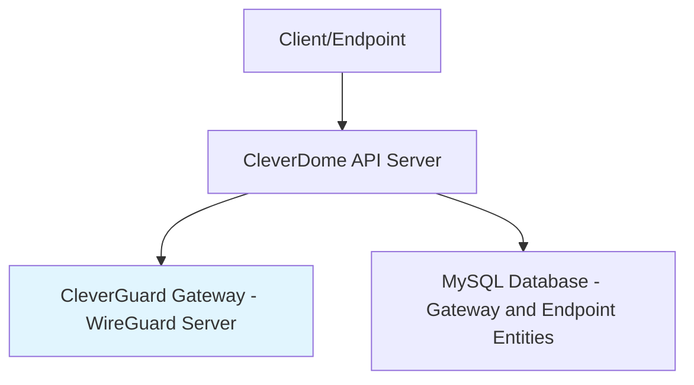

# /swt:mermaid — Mermaid Diagram Guidelines

These rules ensure Mermaid diagrams render correctly in Markdown viewers like GitHub and documentation tools.

## Common Issues and Fixes

### Line Breaks in Labels

- Avoid HTML tags like ` ` — Mermaid does not support them
- Use `\n` for line breaks (e.g., `Node Label\nSecond Line`)
- If `\n` causes issues, simplify labels by using dashes or removing sub-labels (e.g., `Gateway - WireGuard Server` instead of `Gateway\n(WireGuard Server)`)

### Special Characters

- Parentheses in labels can cause parsing errors, especially with certain parsers
- Replace with dashes or rephrase (e.g., `Endpoint Management and Config` instead of `(Endpoint Management & Config)`)
- Avoid ampersands (`&`) — use `and` or remove them

### Node and Edge Syntax

- Rectangles: `A[Label]`
- Circles: `A((Label))`
- Edges: `A --> B` (directed), `A -.-> B` (dotted)
- Subgraphs: `subgraph "Title"` / `end`

### Error Messages

- Parse errors often indicate unexpected tokens (e.g., 'PS' from parentheses)
- Simplify the diagram step-by-step to isolate the issue
- Test in [Mermaid Live Editor](https://mermaid.live) or VS Code extension before finalizing

## Example Valid Diagram

