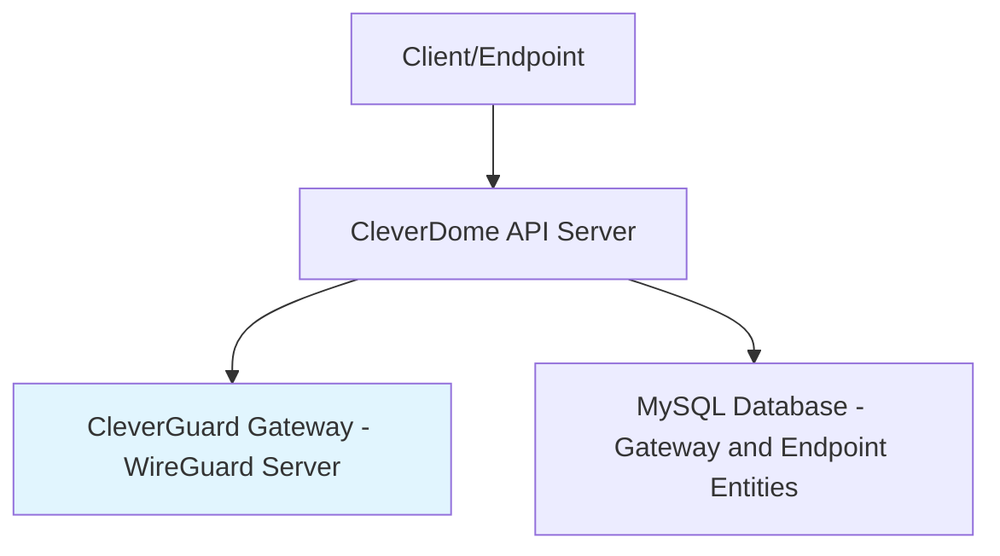
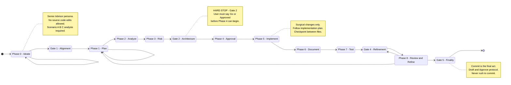

# /swt:mermaid — Mermaid Diagram Guidelines

These rules ensure Mermaid diagrams render correctly in Markdown viewers like GitHub and documentation tools.

> [!IMPORTANT]
> **Always test in [Mermaid Live Editor](https://mermaid.live) before finalizing any diagram.** Copy your code, paste it, and confirm zero parse errors. This is a mandatory step — not optional.

## Common Issues and Fixes

### Line Breaks in Labels

- Avoid HTML tags like `<br/>` — Mermaid does not support them
- Use `\n` for line breaks inside `graph TD` node labels (e.g., `Node Label\nSecond Line`)
- For `stateDiagram-v2`, use the `state "Label\nAlias" as ID` syntax for multiline state names
- If `\n` causes issues, simplify labels by using dashes or removing sub-labels

### Special Characters

- Parentheses in labels can cause parsing errors, especially with certain parsers
- Replace with dashes or rephrase (e.g., `Endpoint Management and Config` instead of `(Endpoint Management & Config)`)
- Avoid ampersands (`&`) — use `and` or remove them
- Avoid colons (`:`) in edge labels and state name definitions — they break parsing

### Node and Edge Syntax

- Rectangles: `A[Label]`
- Circles: `A((Label))`
- Edges: `A --> B` (directed), `A -.-> B` (dotted)
- Subgraphs: `subgraph "Title"` / `end`

## Diagram Type Reference

### graph TD (Flowcharts)

Use `graph TD` for top-down flowcharts, network diagrams, and process flows.

See the [Graph TD Example](#example-graph-td-flowchart) below.

### stateDiagram-v2 (State Machines)

Use `stateDiagram-v2` for state transition diagrams, workflow machines, and lifecycle models.

#### Syntax Rules

1. **State declarations** — Declare all states before using them in edges:
   ```
   state "State Name" as ID
   ```

2. **Multiline state names** — Use `\n` inside the alias syntax, not raw newlines:
   ```
   state "Phase 0 - Ideate" as P0
   ```
   Do NOT use: `Phase0: Phase 0: Brainstorm (loop)` — colons and parentheses break parsing.

3. **Edge labels** — Keep edges bare. Do NOT use colons in edge labels:
   ```
   P0 --> P1
   ```
   Do NOT use: `A --> B: swt:task graduate` — colons cause parse errors.

4. **Parentheses** — Avoid in all labels. Replace with dashes or rephrase.

5. **Notes** — Use `note` blocks for multiline annotations, never raw newlines:
   ```
   note right of ID
       Line one.
       Line two.
   end note
   ```

6. **All nodes must be declared** — Every node referenced in an edge must exist as a declaration or `state` alias.

#### Example: SWT 8-Phase Workflow State Machine

See [stateDiagram-v2 Example](#example-statediagram-v2-state-machine) below.

## Error Messages

- **Parse errors** often indicate unexpected tokens (e.g., 'PS' from parentheses, 'DESCR' from colons)
- **"Expecting ... got ..."** — Usually a colon or special character issue. Remove colons from edges and state names.
- **Missing node errors** — All nodes in edges must be declared. Check for typos in state aliases.
- **Note block errors** — Ensure every `note` has a matching `end note`.

### Error Resolution Steps

1. Check for and remove colons in edge labels and state names
2. Check for and replace parentheses with dashes
3. Verify all edges use bare arrows (`A --> B`) without colon-separated labels
4. Verify all nodes are declared before use
5. Verify multiline content uses proper syntax (`state "..." as` or `note` blocks)
6. **Test in [Mermaid Live Editor](https://mermaid.live)** — mandatory before finalizing

## Examples

### Example: graph TD Flowchart



### Example: stateDiagram-v2 State Machine

> [!IMPORTANT]
> **Canonical Source**: The primary state transition diagram is defined in the root **`AGENTS.md`**. This skill provides technical reference, but the root protocol is the source of truth for all orchestrations.

The SWT 8-Phase Workflow validated in Mermaid Live Editor:


