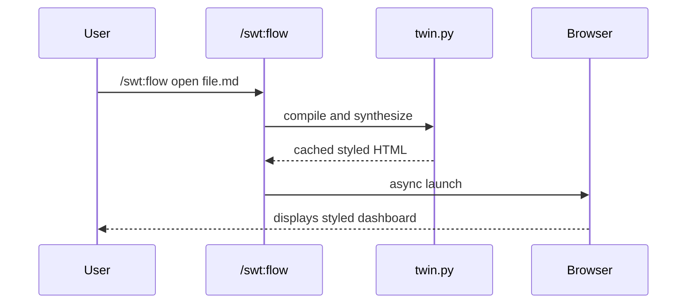

# Universal Viewport Mock Fixture

**Created**: 2026-05-18 06:20:00
**Updated**: —
**Completed**: —
**Status**: pending
**Priority**: low
**Type**: brainstorm
**Stack**: shared

> **Covers**: Verification mock representing a generic project markdown document with inline architecture visualizations.

## Core Objective
Prove that the HTML compiler parses non-prefixed generic headers and renders interactive sequence diagrams flawlessly.

## Core Checklist
- [x] Step 1: Initialize parser
- [/] Step 2: Render section
- [ ] Step 3: Trigger Mermaid rendering

## Mermaid Visualization
Here is the target sequence diagram that will be compiled dynamically:

## Extra Notes
This is just a mock fixture.
